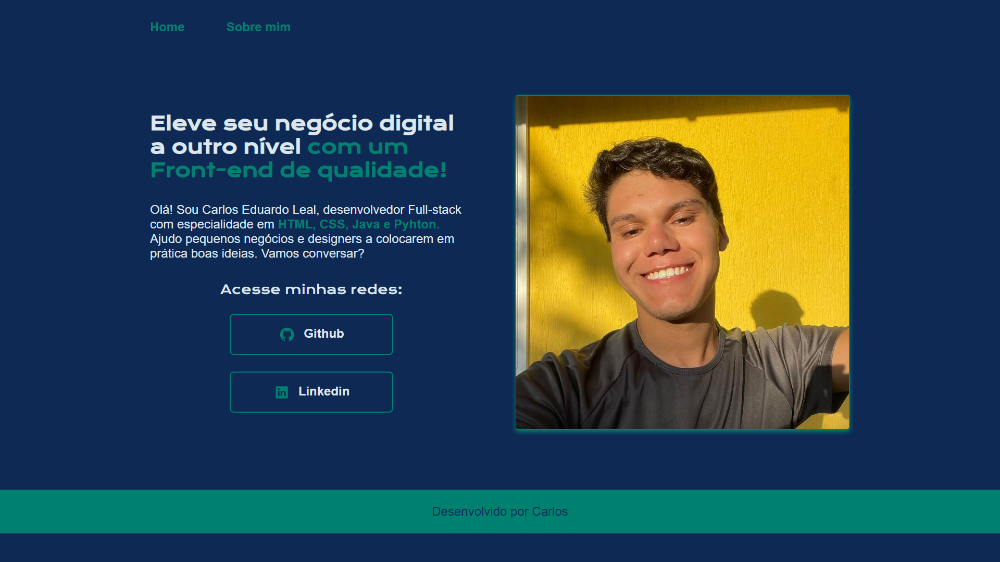

# Web Page - Meu Portifólio

## Descrição
Este projeto é o meu portfólio pessoal, onde apresento meus conhecimentos e habilidades em desenvolvimento web. Aqui, você encontrará exemplos de projetos que desenvolvi, as tecnologias que domino e um pouco sobre a minha trajetória profissional. O objetivo deste portfólio é demonstrar minhas capacidades técnicas e servir como uma vitrine para possíveis empregadores e colaboradores.

## Screenshot

## Tecnologias Utilizadas

- HTML5
- CSS3
### Acesso ao projeto

O projeto pode ser visualizado clicando [aqui](https://carlosleal.x10.mx/)

